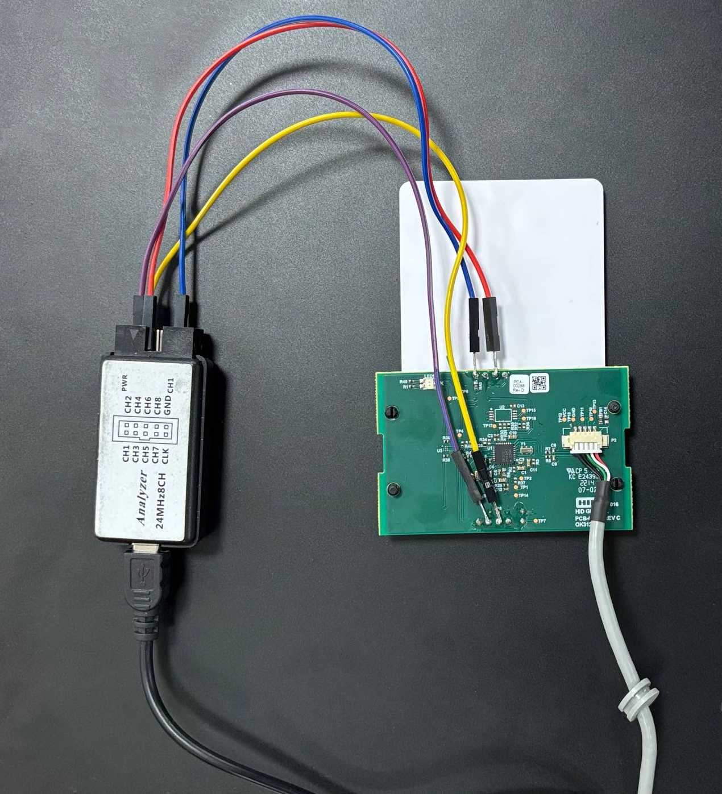
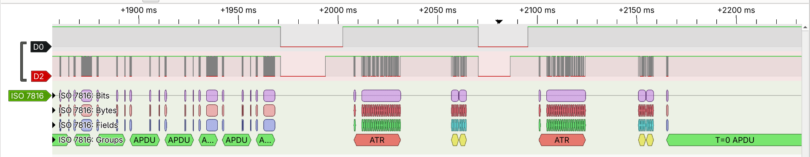
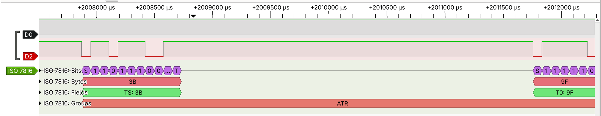
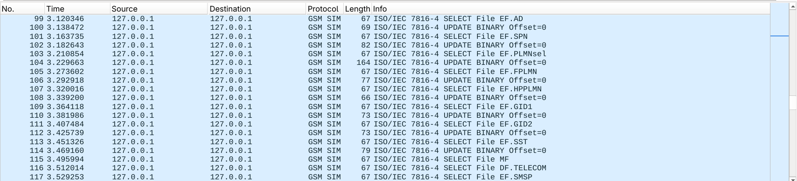
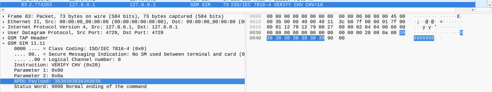

# ISO 7816 Smart Card Protocol Decoder for Sigrok

[]()
[](https://sigrok.org/)
[](https://python.org)
[](LICENSE)

A robust protocol decoder for the **ISO 7816 Smart Card** standard, built as a plug-in for the [libsigrokdecode](https://sigrok.org/wiki/Libsigrokdecode) framework.

Whether you are reverse engineering a SIM card, analyzing EMV transactions, or troubleshooting custom smart cards with a logic analyzer via **PulseView** or **sigrok-cli**, this decoder provides deep packet inspection, automated baud rate detection, and seamless Wireshark integration.

<p align="center">

</p>

The figure above demonstrates a typical hardware setup for intercepting ISO 7816 traffic. A logic analyzer is connected to a SIM reader, probing the **GND** (common ground), **RESET**, **I/O** lines. The SIM reader itself is connected to the computer via USB. A proprietary software is used to store data in the SIM card. (*As you can notice, there's a probe in the clock pin that was used during development to verify the timing, but is not required for the decoder to function*)

---

## ✨ Features

- **Multi-ATR Handling:** Unlike other implementations (e.g., [`svenso/sigrok_iso7816`](https://github.com/svenso/sigrok_iso7816)), this decoder gracefully handles mid-session hardware resets and multiple ATR broadcasts, avoiding incorrect parsing or dropping messages.
- **Dynamic Auto-Baud Detection:** No clock line required! The decoder handles baud rates in two distinct phases: (1) measuring the initial ETU directly from the first falling edge pulse of the Answer To Reset (ATR), and (2) parsing the ATR data parameters and Protocol Parameter Selection (PPS) to dynamically adjust the baud rate for all subsequent messages.
- **Direct & Inverse Convention Support:** Natively adapts to both standard (Direct: `0x3B`) and reversed/inverted (Inverse: `0x3F`) bit-ordering conventions on the fly.
- **Deep Protocol Inspection (T=0 & T=1):**
  - **T=0:** Parses headers, procedure bytes, and groups the payload into contiguous APDUs.
  - **T=1:** Extracts the Prologue (NAD, PCB, LEN), Information Field, and validates the Epilogue (LRC/CRC).
- **Wireshark Integration (PCAP Export):** Automatically exports raw card traffic into a standard binary PCAP file encapsulated with GSMTAP headers, preserving accurate real-time packet timestamps. Simply open the output in Wireshark for instant deep-dive APDU packet analysis.
- **Robust State Machine:** Built with a clean `PhysicalLayer` and `ProtocolLayer` architecture, verified by a comprehensive End-to-End bit stream testing framework.

---

## 🚀 Installation

Before installing the decoder, you need to have the **sigrok** suite (PulseView and sigrok-cli) installed on your system, along with the appropriate logic analyzer drivers to capture the hardware signals.

### 1. Install PulseView, sigrok-cli & Drivers

```bash
# debian/ubuntu
sudo apt update
sudo apt install -y pulseview sigrok-cli sigrok-firmware-fx2lafw

# fedora
sudo dnf install -y pulseview sigrok-cli sigrok-firmware-fx2lafw
```

Grant your user permission to access the USB device:

```bash
sudo usermod -a -G dialout $USER
```

**Restart the machine** for the dialout group changes to apply.

### 2. Install the ISO 7816 Decoder

Once PulseView is set up and can successfully communicate with your logic analyzer, install this plugin by placing the project folder into your local `libsigrokdecode` directory.

```bash
# Create the local decoders directory if it doesn't exist
mkdir -p ~/.local/share/libsigrokdecode/decoders/

# Clone or copy this repository into the decoders folder
git clone https://github.com/arthursimas1/sigrok_iso7816.git ~/.local/share/libsigrokdecode/decoders/iso7816
```

**Restart PulseView** to reload the plugins list. You will now find **"ISO 7816 Smart Card"** available in the decoders list.

---

## 🛠️ Usage: step-by-step guide

### 1. Collect data

1. Open **PulseView**
2. Connect to your logic analyzer
3. Add the **"ISO 7816 Smart Card"** protocol from the decoders list
4. Assign the respective logic analyzer channels to `RESET` and `I/O`
5. Set your desired **sampling rate** and **sample amount**\*
6. Press **Run** to start capturing the data

> *\* Tip: I personally use the highest sampling rate my logic analyzer supports and a continuous/high sample amount. I then manually stop the capture once the transaction I want to inspect is complete.*






### 2. Export the capture (`.sr`)

Once you have successfully captured the communication in PulseView, you need to save the raw session data to process it via the command line.

1. Go to **Save As** in the menu bar
2. Save the file as `capture.sr` in your working directory

### 3. Convert to PCAP (sigrok-cli)

To perform deep packet inspection in Wireshark, use sigrok-cli to run the decoder against your saved `.sr` file and dump the binary output into a `.pcap` file.

Open your terminal and run the following command:

```bash
sigrok-cli -i capture.sr -P iso7816:reset=D0:io=D1 -B iso7816=pcap > output.pcap
```

> *Note: In the example above, replace D0 and D1 with the actual logic analyzer pin names connected to the RESET and I/O lines respectively.*

### 4. View in Wireshark

1. Open Wireshark
2. Go to **File > Open** and select your newly generated `output.pcap`

Because the decoder encapsulates the data with GSMTAP headers, you can immediately inspect the APDUs, headers, and payload data natively with accurate timestamps.





---

## 🧪 Architecture & Testing

This decoder is built for maintainability and correctness, strictly separating signal processing from protocol mathematics:

- `PhysicalLayer`: Handles bit sampling, ETU timing delays, and parity checking.
- `ProtocolLayer`: Manages ATR parsing, PPS (Protocol Parameter Selection) negotiation, and T=0/T=1 framing.
- `Decoder`: Interfaces with the `sigrokdecode` API lifecycle.

**Testing:** The project includes a 100% native bit-stream simulation (`ISO7816Stream`) that feeds exact logical edge transitions to the `wait()` condition loops, allowing the entire physical and protocol pipeline to be unit tested End-to-End without external mocks.

Before running the tests, ensure you have installed the required development dependencies:
```bash
pip install -r requirements.txt
```

```bash
# Run the integration test suite with coverage
python3 -m coverage run test_pd.py

# Generate the HTML coverage report
python3 -m coverage html
```
